<h1>Data Insights for Tech Skills 📊</h1> 

> Note: This project is split into multiple repositories to keep things organized. You can click on the respective links for each section to explore further details and access files.

## 📂 Sections
  <ul>
    <li><a href = '#data-collection'>Data Collection</a></li>
    <li><a href = '#data-wrangling'>Data Wrangling</a></li>
    <li><a href = '#exploratory-data'>Exploratory Data Analysis</a></li>
    <li><a href = '#data-visualization'>Data Visualization</a></li>
    <li><a href = '#dashboard'>Dashboard Creation</a></li>
    <li><a href = '#presenting'>Presenting Findings</a></li>
  </ul>

<h2> 🎯 Project Scenario</h2>

In this project, I collect data from multiple sources and identify emerging in-demand tech skills. Using sources from job postings, training portals, and the Stack Overflow Developer Survey, I will employ data analysis techniques to uncover the current trends in programming skills, databases, and development tools. 

I will start with collecting data from web scraping, APIs, and datasets in various formats (.csv, Excel, databases). Then, I would clean and prepare the data using data wrangling techniques. After the data is ready, I will apply exploratory analysis to identify key trends. I will then proceed with visualizing insights about the top technology trends. Finally, I will create a dashboard with Tableau and share my findings through a presentation.
 

<h2>❓ Problem & Objective 🚀</h2>

Technology skills evolve quickly, making it difficult for companies to align talent with demand. IT consulting firms must stay competitive by understanding emerging tech skills. I aim to help organizations focus hiring,
training, and investments in the right areas by providing data-driven insights and predictive analysis into which programming languages, databases, and tools are most in demand. 

I will answer these questions: 

<ul>
  <li>Which programming languages are most in demand?</li>
  <li>Which database technologies are currently most sought after?</li>
  <li>Which Integrated Development Environments (IDEs) are the most popular?</li>
</ul>

<h2>🛠️ Tools & Skills Used</h2>

<ul>
  <li><strong>Languages:</strong> Python, SQL</li>
  <li><strong>Tools:</strong> Visual Studio Code, Jupyter notebook</li>
  <li><strong>Data Collection:</strong> Web scraping, Jobs API (Requests, BeautifulSoup, Pandas)</li>
  <li><strong>Data Wrangling:</strong> Cleaning, Normalizing (Pandas, Numpy)</li>
  <li><strong>Data Analysis:</strong> Exploratory, Statistical, Trends (Pandas, Matplotlib, Seaborn, SQLite, Numpy)</li>
  <li><strong>Data Visualization:</strong> Various Charts, Plots, or Graphs (Pandas, Matplotlib, Seaborn, SQLite)</li>
  <li><strong>Dashboards:</strong> Tableau, Dash (Plotly, Dash Bootstrap)</li>
  <li><strong>Presenting:</strong> Microsoft Powerpoint</li>
</ul>

<h2>🌐 Data Sources</h2>

### Primary Data Source

The primary dataset used is the 2024 Stack Overflow global survey. Stack Overflow is a Q&A website for programmers where developers ask coding questions and get answers from the community. The survey aims to capture insights on developers' experiences, tools, technologies, and preferences, offering a snapshot of the software development landscape.

🔗 [Original Source](https://stackoverflow.blog/2024/08/06/2into4-developer-survey/) (Stack Overflow)  

🔗 [Original Dataset](https://www.kaggle.com/datasets/failureh3ro/stack-overflow-survey-data-2024-subset) (Kaggle)

> [!NOTE]
> The dataset is a subset of the original data

### Other Sources

These are some sources used in the beginning process, but ultimately not used in the later stages. 

🔗 [Jobs on Naukri](https://www.kaggle.com/promptcloud/jobs-on-naukricom)

> Dataset on Kaggle.com

🔗 [Popular Programming Languages](https://cf-courses-data.s3.us.cloud-object-storage.appdomain.cloud/IBM-DA0321EN-SkillsNetwork/labs/datasets/Programming_Languages.html)

> Website on the IBM Cloud

<h2 id = 'data-collection'>📝 Data Collection</h2>

The data collection section is the first step of the data analysis process. In this stage, I will gather data from the Jobs API, web scraping, and the Stack Overflow developer survey. 

<h3>Jobs API Data Collection</h3>

I worked with the Jobs API provided by IBM to collect and analyze job posting data. Using Python, Pandas, and Requests in a Jupyter Notebook, I processed JSON data to identify job demand across technologies and locations. The results were exported to Excel for further analysis, providing insights into hiring demands. Although the insights from this section were not included in the final presentation, the process provided valuable hands-on experience.

👉 [Data Collection - Jobs API repository](https://github.com/FaiLuReH3Ro/data-collection-jobs-api)

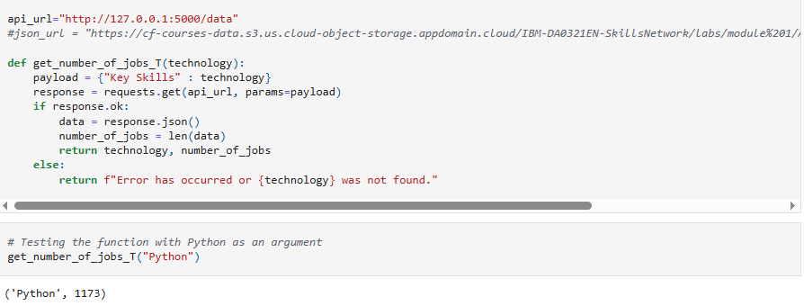

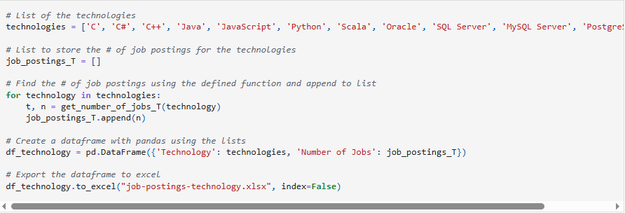

### Web Scraping Data Collection

I utilized web scraping techniques with Python to extract information about popular programming languages from an IBM Cloud website. Using Pandas, Beautiful Soup, and Requests in a Jupyter Notebook, I scraped the names and average salaries corresponding to programming languages before exporting the data to a CSV file for potential future use. Even though the scraped data were not applied in the final analysis, this step offered valuable experience in web scraping data collection. 

👉 [Data Collection - Web Scraping repository](https://github.com/FaiLuReH3Ro/data-collection-web-scraping)

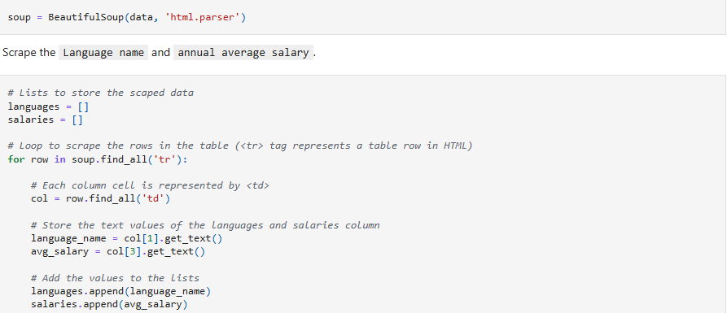

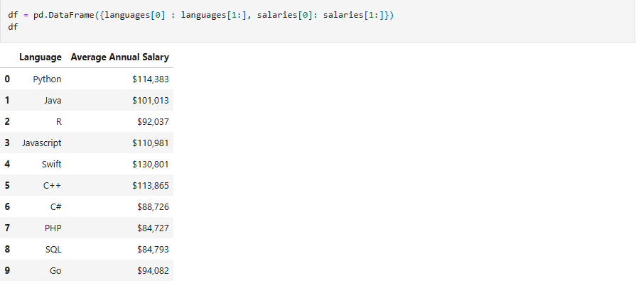

### Dataset Exploration

As an initial step, I explored the Stack Overflow survey dataset in Jupyter Notebook using Python and Pandas. I examined the dataset's structure, including row count, column names, and data types, to gain familiarity with the data before deeper analysis.

👉 [Exploring Dataset repository](https://github.com/FaiLuReH3Ro/exploring-dataset) 

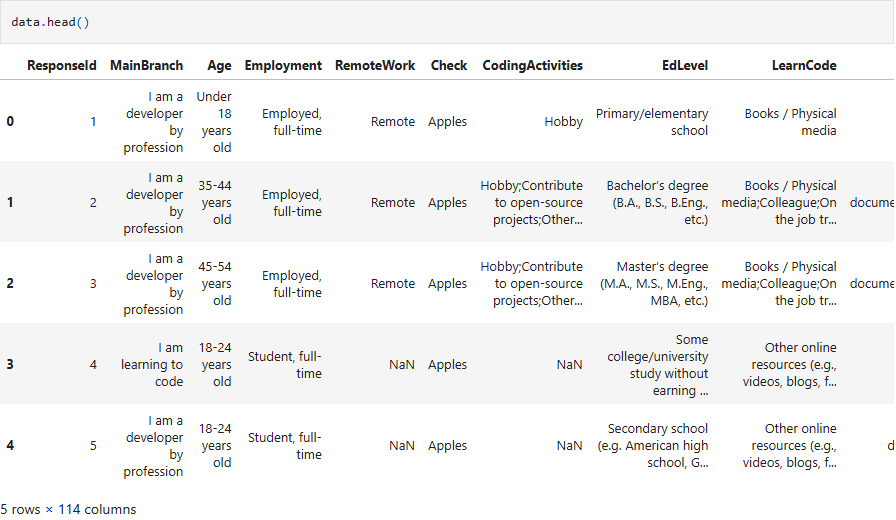

<h2 id = 'data-wrangling'>🔧 Data Wrangling</h2>

Data wrangling is an essential step in data analysis. Since raw datasets often contain inconsistencies or missing values, they must be cleaned and prepared to enable accurate and reliable analysis.

I applied data wrangling techniques in Python to clean the dataset before performing the analysis. Using Python libraries such as Pandas and Numpy in a Jupyter Notebook, I removed duplicate rows, imputed missing values, performed data normalization, and dropped irrelevant columns. The imputing technique generally replaces missing numeric data with the average and replaces missing categorical data with the most frequent. However, I purposely did not impute every missing value. Since the objective is to gather insights into developers' technologies, I left those columns alone because I did not want to affect the results by skewing the data. Additionally, I dropped columns that will not contribute to the final analysis to improve efficiency and reduce loading times. 

👉 [Data Wrangling - Python repository](https://github.com/FaiLuReH3Ro/data-wrangling-py)

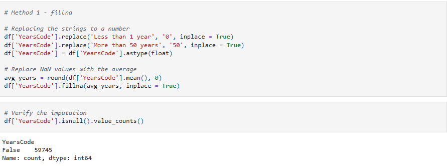

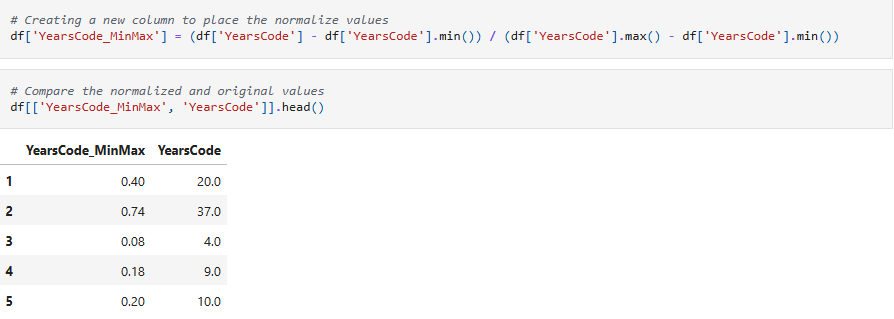

<h2 id = 'exploratory-data'>🔍 Exploratory Data Analysis</h2>

### EDA

I conducted Exploratory Data Analysis (EDA) on the cleaned dataset using Python to explore distributions and relationships across multiple variables. Using visualization libraries like Matplotlib and Seaborn, I created bar, grouped and stacked bar charts, histograms, and pie charts to identify trends and insights outside of the data about the technologies. 

👉 [Exploratory Data Analysis - Python repository](https://github.com/FaiLuReH3Ro/exploratory-da-py)

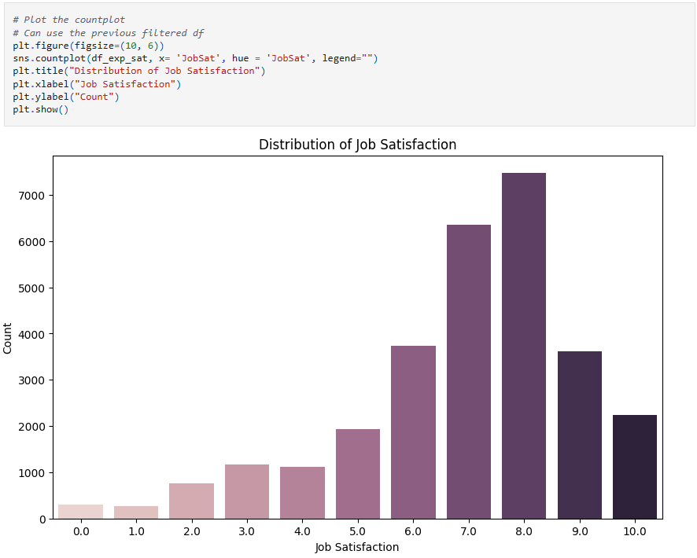

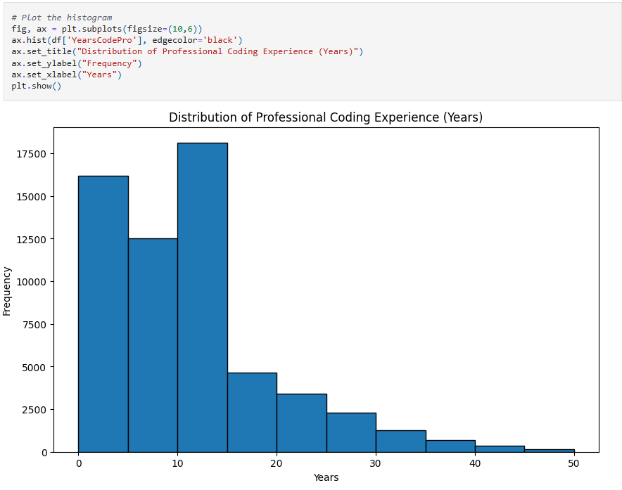

### Handling Outliers

In this section, I addressed outliers to improve the variance in the compensation data. I used Python, Pandas, SQL, and SQLite in a Jupyter Notebook to load the clean dataset into a database and identify outliers in the two compensation columns. Outliers were removed to ensure better visualizations, and the results were stored in a separate database table for future use. I visualized the no-outlier data with histograms, bar charts, and boxplots to better understand the distribution of the compensation data. 

👉 [Handling Outliers - Python repository](https://github.com/FaiLuReH3Ro/outliers-py)

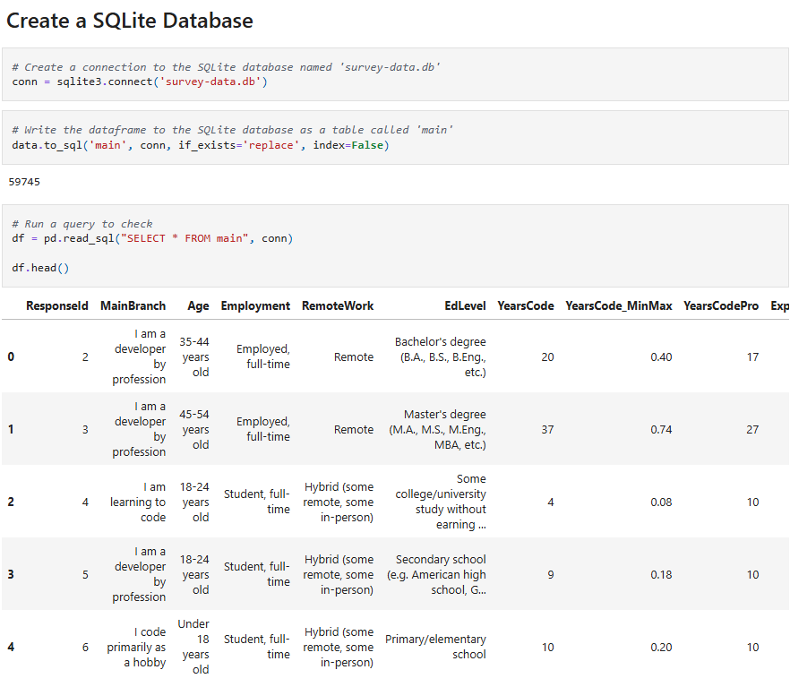

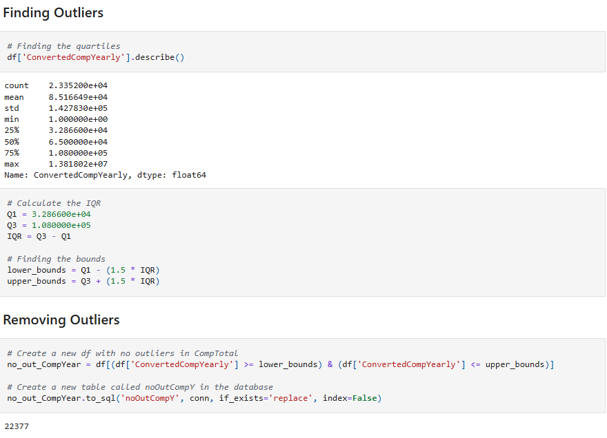

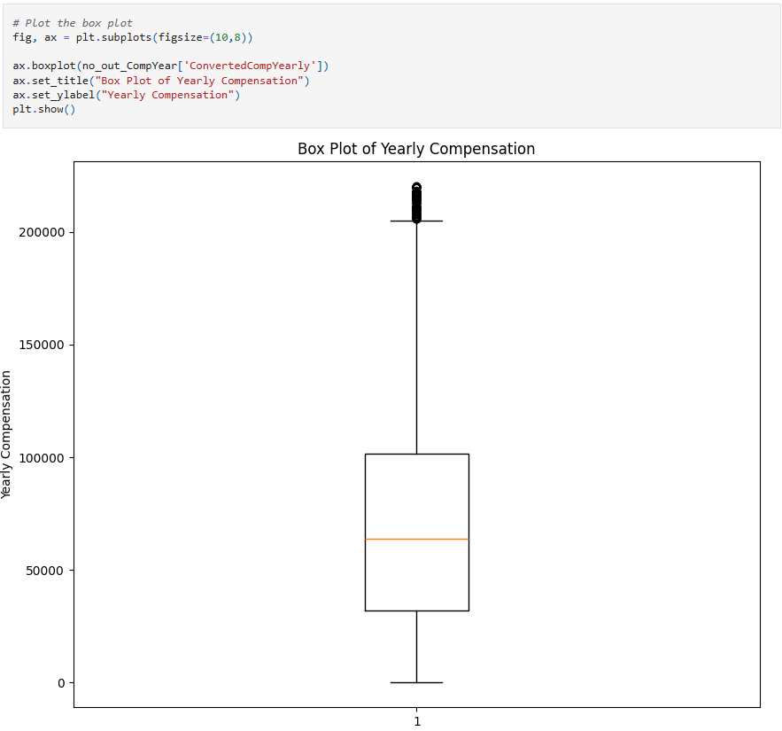

### Finding Correlations

Using the tables in the created database in SQLite, I will explore the data further by finding correlations and trends between various columns. I utilized Python visualization libraries such as Matplotlib and Seaborn to create scatter plots, line plots, and a heat map to show trends and correlations between numeric data. 

👉 [Finding Correlations - Python repository](https://github.com/FaiLuReH3Ro/correlations-py)

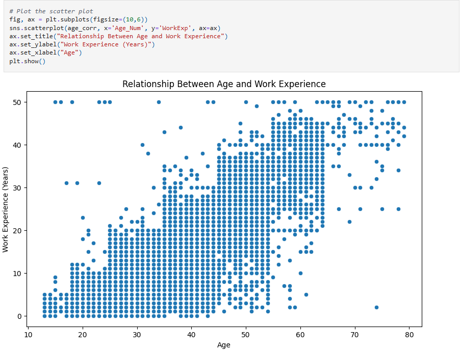

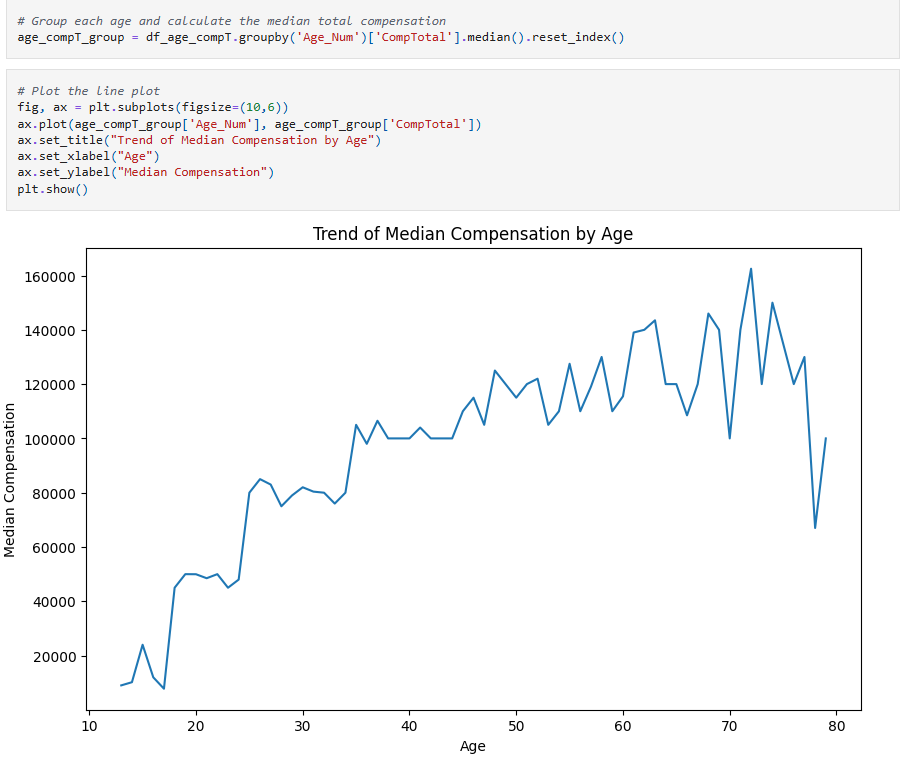

<h2 id = 'data-visualization'>📈 Data Visualization</h2>

In this part, I will apply data visualization in Python to discover insights about the key objectives. Using Matplotlib and Seaborn, I visualized horizontal bar charts to display the distribution of the top programming languages, databases, web frameworks, platforms, collaboration tools, and tech tools for both used and desired cases. These visualizations will serve as the key indicators for finding the current popular technologies and future trends. 

👉 [Data Visualization - Python repository](https://github.com/FaiLuReH3Ro/data-visualization-py)

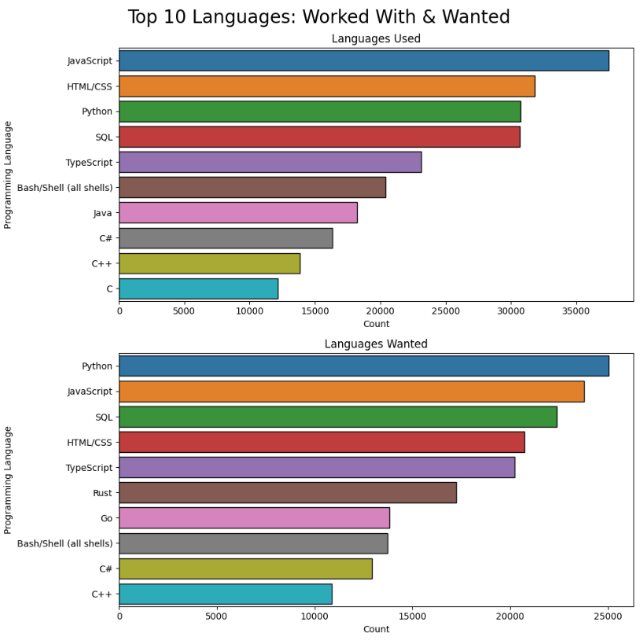

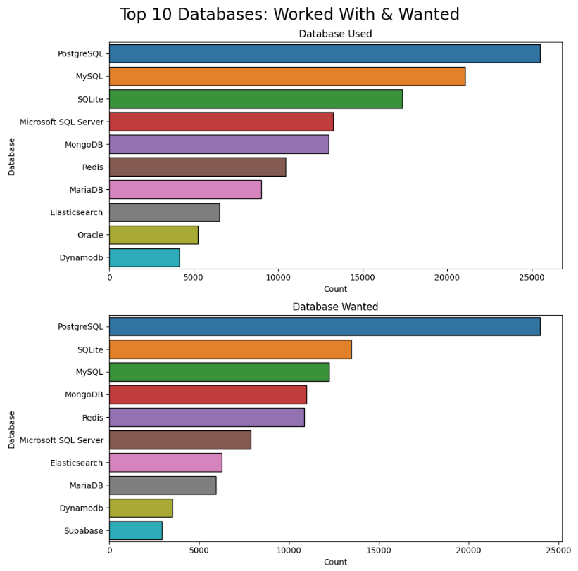

<h2 id = 'dashboard'>🖥️ Dashboard Creation</h2>

### Tableau Dashboard

I applied dashboard creation skills to create a shareable and interactive dashboard with Tableau. Users can easily explore and find information about technology usage, future usage, and survey demographics. 

👉 [Survey Results Dashboard](https://public.tableau.com/views/SurveyResultsDashboard_17555489432820/CurrentTechnologyUsage?:language=en-US&:sid=&:redirect=auth&:display_count=n&:origin=viz_share_link)

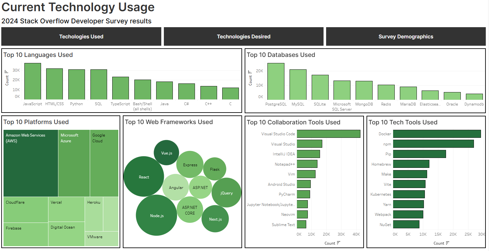

### Plotly Dash Dashboard

As a bonus project, I created a dashboard with the Dash framework from scratch. I applied Python programming with the Plotly library to create an interactive dashboard as a live web application. Like the Tableau dashboard, it contains charts about current technology trends, future trends, and demographics. 

👉 [Stack Overflow Survey Dashboard repository](https://github.com/FaiLuReH3Ro/dev-survey-dashboard)

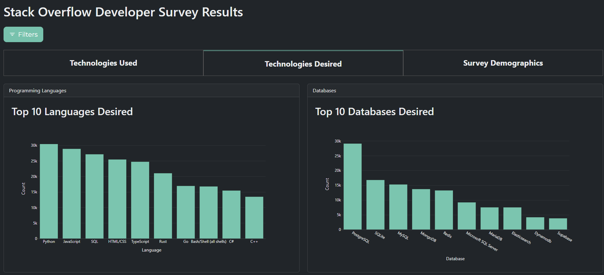

<h2 id = 'presenting'>🎤 Data Presenting</h2>

This section marks the final step of the process. After creating the dashboards and uncovering insights on the top technologies, I will make a report highlighting my findings and implications. Using data-driven insights and predictive analysis, I aim to help organizations focus on investing in the popular programming languages, databases, and tools.

👉 [Developer Survey Presentation repository](https://github.com/FaiLuReH3Ro/dev-survey-presentation)

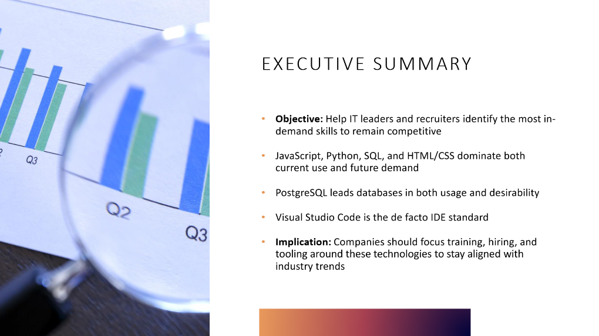

