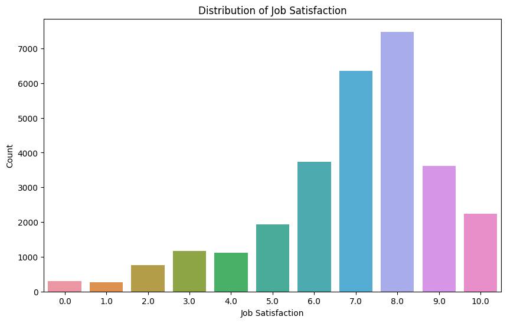

<h1>Data Insights for Tech Skills 📊</h1><br>

> [!NOTE]
> This project is split into multiple repositories to keep things organized. You can click on the respective links for each section to explore further details and access files.


## 📂 Sections
  <ul>
    <!--<li><a href = '#data-collection'>Data Collection</a></li>-->
    <li><a href = '#data-wrangling'>Data Wrangling</a></li>
    <li><a href = '#exploratory-data'>Exploratory Data Analysis</a></li>
    <li><a href = '#data-visualization'>Data Visualization</a></li>
    <li><a href = '#dashboard'>Dashboard Creation</a></li>
    <li><a href = '#presenting'>Presenting Findings</a></li>
  </ul>


<h2> 🎯 Project Scenario</h2>

I will utilize a subset of the 2024 Stack Overflow Developer Survey for this project to identify emerging in-demand tech skills. My approach will involve data analysis techniques to uncover current trends in programming skills, databases, and development tools.

I will begin by cleaning and preparing the data using data wrangling techniques. Once the data is ready, I will conduct an exploratory analysis to identify compensation trends and use various charts to visualize distributions. Next, I will visualize insights regarding the top technology trends. Finally, I will create a dashboard using Tableau to present my findings.

<h2>❓ Problem & Objective 🚀</h2>

<p>Technology skills evolve quickly, making it difficult for companies to align talent with demand. IT consulting firms must stay competitive by understanding emerging tech skills. I aim to help organizations focus hiring,
training, and investments in the right areas by providing data-driven insights and predictive analysis into which programming languages, databases, and tools are most in demand. </p>

<p>I will answer these questions: </p>

<ul>
  <li>Which programming languages are most in demand?</li>
  <li>Which database technologies are currently most sought after?</li>
  <li>Which Integrated Development Environments (IDEs) are the most popular?</li>
</ul>

<h2>🛠️ Tools & Skills Used</h2>

<ul>
  <li><strong>Languages:</strong> Python, SQL</li>
  <li><strong>Tools:</strong> Visual Studio Code, Jupyter notebook</li>
  <li><strong>Data Collection:</strong> Web scraping, Jobs API (Requests, BeautifulSoup, Pandas)</li>
  <li><strong>Data Wrangling:</strong> Cleaning, Normalizing (Pandas, Numpy)</li>
  <li><strong>Data Analysis:</strong> Exploratory, Statistical, Trends (Pandas, Matplotlib, Seaborn, SQLite, Numpy)</li>
  <li><strong>Data Visualization:</strong> Various Charts, Plots, or Graphs (Pandas, Matplotlib, Seaborn, SQLite)</li>
  <li><strong>Dashboards:</strong> Tableau, Dash (Plotly, Dash Bootstrap)</li>
  <li><strong>Presenting:</strong> Microsoft Powerpoint</li>
</ul>

<h2>🌐 Data Sources</h2>

### Primary Data Source

The primary dataset used is the 2024 Stack Overflow global survey. Stack Overflow is a Q&A website for programmers where developers ask coding questions and get answers from the community. The survey aims to capture insights on developers' experiences, tools, technologies, and preferences, offering a snapshot of the software development landscape.

🔗 [Original Source](https://stackoverflow.blog/2024/08/06/2into4-developer-survey/) (Stack Overflow) <br>

🔗 [Original Dataset](https://www.kaggle.com/datasets/failureh3ro/stack-overflow-survey-data-2024-subset) (Kaggle)

> [!NOTE]
> The dataset is a subset of the original data

<!--
### Other Sources

These are some sources used in the beginning process, but ultimately not used in the later stages. 

🔗 [Jobs on Naukri](https://www.kaggle.com/promptcloud/jobs-on-naukricom)

> Dataset on Kaggle.com

🔗 [Popular Programming Languages](https://cf-courses-data.s3.us.cloud-object-storage.appdomain.cloud/IBM-DA0321EN-SkillsNetwork/labs/datasets/Programming_Languages.html)

> Website on the IBM Cloud

<h2 id = 'data-collection'>📝 Data Collection</h2>

The data collection section is the first step of the data analysis process. In this stage, I will gather data from the Jobs API, web scraping, and the Stack Overflow developer survey. 

<h3>Jobs API Data Collection</h3>

I worked with the Jobs API provided by IBM to collect and analyze job posting data. Using Python, Pandas, and Requests in a Jupyter Notebook, I processed JSON data to identify job demand across technologies and locations. The results were exported to Excel for further analysis, providing insights into hiring demands. Although the insights from this section were not included in the final presentation, the process provided valuable hands-on experience.

👉 [Data Collection - Jobs API repository](https://github.com/FaiLuReH3Ro/data-collection-jobs-api)


<hr>

### Web Scraping Data Collection

I utilized web scraping techniques with Python to extract information about popular programming languages from an IBM Cloud website. Using Pandas, Beautiful Soup, and Requests in a Jupyter Notebook, I scraped the names and average salaries corresponding to programming languages before exporting the data to a CSV file for potential future use. Even though the scraped data were not applied in the final analysis, this step offered valuable experience in web scraping data collection. 

👉 [Data Collection - Web Scraping repository](https://github.com/FaiLuReH3Ro/data-collection-web-scraping)


<hr>

### Dataset Exploration

As an initial step, I explored the Stack Overflow survey dataset in Jupyter Notebook using Python and Pandas. I examined the dataset's structure, including row count, column names, and data types, to gain familiarity with the data before deeper analysis.

👉 [Exploring Dataset repository](https://github.com/FaiLuReH3Ro/exploring-dataset) 


-->
<h2 id = 'data-wrangling'>🔧 Data Wrangling</h2>

Data wrangling is an essential step in data analysis. Since raw datasets often contain inconsistencies or missing values, they must be cleaned and prepared to enable accurate and reliable analysis.

I applied data wrangling techniques in Python to clean the dataset before performing the analysis. Using Python libraries such as Pandas and Numpy in a Jupyter Notebook, I removed duplicate rows, imputed missing values, performed data normalization, and dropped irrelevant columns. The imputing technique generally replaces missing numeric data with the average and replaces missing categorical data with the most frequent. However, I purposely did not impute every missing value. Since the objective is to gather insights into developers' technologies, I left those columns alone because I did not want to affect the results by skewing the data. Additionally, I dropped columns that will not contribute to the final analysis to improve efficiency and reduce loading times. 


👉 [Data Wrangling - Python repository](https://github.com/FaiLuReH3Ro/data-wrangling-py)

### Imputing Missing Values in Numeric Columns
```Python
# Method 1 - fillna

# Replacing the strings to a number
df['YearsCode'].replace('Less than 1 year', '0', inplace = True)
df['YearsCode'].replace('More than 50 years', '50', inplace = True)
df['YearsCode'] = df['YearsCode'].astype(float)

# Replace NaN values with the average
avg_years = round(df['YearsCode'].mean(), 0)
df['YearsCode'].fillna(avg_years, inplace = True)
```

### Imputing Missing Values in Categorical Columns
```Python
# Method 2 - replace

# Finding the most frequent value
freq_ed_level = df['EdLevel'].mode()[0]

# Replace the NaN with most frequent value
df['EdLevel'].replace(np.nan, freq_ed_level, inplace = True)
```

### Min-Max Scaling
```Python
# Creating a new column to place the normalized values
df['YearsCode_MinMax'] = (df['YearsCode'] - df['YearsCode'].min()) / (df['YearsCode'].max() - df['YearsCode'].min())

# Compare the normalized and original values
df[['YearsCode_MinMax', 'YearsCode']].head()
```

| | YearsCode_MinMax | YearsCode |
|:---:|:---:|:---:|
| 1 | 0.40 | 20.0 |
| 2 | 0.74 | 37.0 |
| 3 | 0.08 | 4.0 |
| 4 | 0.18 | 9.0 |
| 5 | 0.20 | 10.0 |

### Binning

```Python
# Create the ranges and labels
ranges = [0, 3, 5, 8, 10, 100]

# Store the names for each range
range_labels = ['Entry', 'Mid', 'Senior', 'Lead', 'Architect']

# Using the function cut to apply the bins
df['ExperienceLevel'] = pd.cut(df['YearsCodePro'], bins = ranges, labels = range_labels, include_lowest=True, ordered=False)

# Displaying 10 rows
df[['YearsCodePro', 'ExperienceLevel']].sample(n = 10, random_state = 42)
```

| | YearsCodePro | ExperienceLevel |
|:---:|:---:|:---:|
| 39276 | 2.0 | Entry |
| 2944 | 13.0 | Architect |
| 64994 | 19.0 | Architect |
| 39938 | 1.0 | Entry |
| 34270 | 9.0 | Lead |
| 14389 | 10.0 | Lead |
| 22694 | 5.0 | Mid |
| 30319 | 0.0 | Entry |
| 51141 | 20.0 | Architect |
| 27535 | 3.0 | Entry |

<h2 id = 'exploratory-data'>🔍 Exploratory Data Analysis</h2>

### EDA

I conducted Exploratory Data Analysis (EDA) on the cleaned dataset using Python to explore distributions and relationships across multiple variables. Using visualization libraries like Matplotlib and Seaborn, I created bar, grouped and stacked bar charts, histograms, and pie charts to identify trends and insights outside of the data about the technologies. 

👉 [Exploratory Data Analysis - Python repository](https://github.com/FaiLuReH3Ro/exploratory-da-py)

#### Job Satisfaction Distribution

```Python
# Drop the NaN rows and store in a new df
df_exp_sat = df[['YearsCodePro', 'JobSat']].dropna(ignore_index=True)

# Create the ranges and labels
ranges = [0, 5, 10, 20, 100]
range_labels = ['0-5', '5-10', '10-20', '20+']

# Create a new column with the range values
df_exp_sat['YearsCodeProRange'] = pd.cut(df_exp_sat['YearsCodePro'], bins = ranges, labels = range_labels, include_lowest=True)

# Plot the countplot
# Can use the previous filtered df 
plt.figure(figsize=(10, 6))
sns.countplot(df_exp_sat, x= 'JobSat', hue = 'JobSat', dodge = False)
plt.title("Distribution of Job Satisfaction")
plt.xlabel("Job Satisfaction")
plt.ylabel("Count")
plt.legend().remove()
plt.show()
```



#### Distribution of Coder Type

```Python
# Find the counts of each role
branch_counts = df['MainBranch'].value_counts()

# Plot the pie chart
labels = ['Pro Developer', 'Occasional Coder', 'Learner Coder', 'Hobby Coder', 'Former Developer']
fig, ax = plt.subplots(figsize=(10,6))
ax.pie(branch_counts.values, labels =labels, autopct='%1.1f%%', startangle=0)
ax.set_title("Distribution of Coder Type", fontsize=20)
plt.show()
```


#### Distribution of Years Coding Professionally

```Python
# Plot the histogram
fig, ax = plt.subplots(figsize=(10,6))
ax.hist(df['YearsCodePro'], edgecolor='black')
ax.set_title("Distribution of Professional Coding Experience (Years)")
ax.set_ylabel("Frequency")
ax.set_xlabel("Years")
plt.show()
```


<hr>

### Handling Outliers

In this section, I addressed outliers to improve the variance in the compensation data. I used Python, Pandas, SQL, and SQLite in a Jupyter Notebook to load the clean dataset into a database and identify outliers in the two compensation columns. Outliers were removed to ensure better visualizations, and the results were stored in a separate database table for future use. I visualized the no-outlier data with histograms, bar charts, and boxplots to better understand the distribution of the compensation data. 

👉 [Handling Outliers - Python repository](https://github.com/FaiLuReH3Ro/outliers-py)

#### Create a SQLite Database

```Python
# Load the dataset
data = pd.read_csv('clean_survey_data.csv')

# Create a connection to the SQLite database named 'survey-data.db'
conn = sqlite3.connect('survey-data.db')

# Write the dataframe to the SQLite database as a table called 'main'
data.to_sql('main', conn, if_exists='replace', index=False)

# Run a query to check
df = pd.read_sql("SELECT * FROM main", conn)
```

#### Handling Outliers in Yearly Compensation

```Python
# Finding the quartiles 
df['ConvertedCompYearly'].describe()
```
| Statistic | Value |
| :--- | :--- |
| **count** | 2.335200e+04 |
| **mean** | 8.516649e+04 |
| **std** | 1.427830e+05 |
| **min** | 1.000000e+00 |
| **25%** | 3.286600e+04 |
| **50%** | 6.500000e+04 |
| **75%** | 1.080000e+05 |
| **max** | 1.381802e+07 |

```Python
# Calculate the IQR
Q1 = 3.286600e+04
Q3 = 1.080000e+05
IQR = Q3 - Q1

# Finding the bounds
lower_bounds = Q1 - (1.5 * IQR)
upper_bounds = Q3 + (1.5 * IQR)

# Create a new df with no outliers in CompTotal
no_out_CompYear = df[(df['ConvertedCompYearly'] >= lower_bounds) & (df['ConvertedCompYearly'] <= upper_bounds)]

# Create a new table called noOutCompY in the database
no_out_CompYear.to_sql('noOutCompY', conn, if_exists='replace', index=False)
```

#### Yearly Compensation by Dev Type

```Python
# Create a cursor to execute a query
cursor = conn.cursor()

# Query to find the top 5 dev types
# Store the result in a new view
QUERY = """
CREATE VIEW Top5Dev AS 
SELECT DevType, COUNT(*) AS 'Count'
FROM noOutCompY
WHERE DevType IS NOT NULL
GROUP BY DevType
ORDER BY Count DESC
LIMIT 5;
"""

# Execute the query
cursor.execute(QUERY)

# Preview the created view
pd.read_sql("SELECT * FROM Top5Dev", conn)
```
| DevType | Count |
| :--- | :--- |
| Developer, full-stack | 8049 |
| Developer, back-end | 4519 |
| Developer, front-end | 1381 |
| Developer, desktop or enterprise applications | 1019 |
| Developer, mobile | 776 |

```Python
# Query for the top 5 developers types and their compensation
QUERY = """
SELECT DevType, ConvertedCompYearly
FROM noOutCompY 
WHERE DevType in (SELECT DevType FROM Top5Dev)
"""

# Read the query to a df
top5_dev = pd.read_sql(QUERY, conn)

# Plot the box plots
fig, ax = plt.subplots(figsize=(10,8))
sns.boxplot(top5_dev, x='ConvertedCompYearly',y='DevType',hue='DevType', ax = ax, dodge = False)
ax.set_title("Box Plots of Yearly Compensation by Dev Type")
ax.set_ylabel("Developer Type")
ax.set_xlabel("Yearly Compensation", labelpad=10)
ax.get_legend().remove()

plt.show()
```


<hr>

### Finding Correlations

Using the tables in the created database in SQLite, I will explore the data further by finding correlations and trends between various columns. I utilized Python visualization libraries such as Matplotlib and Seaborn to create scatter plots, line plots, and a heat map to show trends and correlations between numeric data. 

👉 [Finding Correlations - Python repository](https://github.com/FaiLuReH3Ro/correlations-py)


<h2 id = 'data-visualization'>📈 Data Visualization</h2>

In this part, I will apply data visualization in Python to discover insights about the key objectives. Using Matplotlib and Seaborn, I visualized horizontal bar charts to display the distribution of the top programming languages, databases, web frameworks, platforms, collaboration tools, and tech tools for both used and desired cases. These visualizations will serve as the key indicators for finding the current popular technologies and future trends. 

👉 [Data Visualization - Python repository](https://github.com/FaiLuReH3Ro/data-visualization-py)


<h2 id = 'dashboard'>🖥️ Dashboard Creation</h2>

### Tableau Dashboard

I applied dashboard creation skills to create a shareable and interactive dashboard with Tableau. Users can easily explore and find information about technology usage, future usage, and survey demographics. 

👉 [Survey Results Dashboard](https://public.tableau.com/views/SurveyResultsDashboard_17555489432820/CurrentTechnologyUsage?:language=en-US&:sid=&:redirect=auth&:display_count=n&:origin=viz_share_link)


<hr>

### Plotly Dash Dashboard

As a bonus project, I created a dashboard with the Dash framework from scratch. I applied Python programming with the Plotly library to create an interactive dashboard as a live web application. Like the Tableau dashboard, it contains charts about current technology trends, future trends, and demographics. 

👉 [Stack Overflow Survey Dashboard repository](https://github.com/FaiLuReH3Ro/dev-survey-dashboard)


<h2 id = 'presenting'>🎤 Data Presenting</h2>

This section marks the final step of the process. After creating the dashboards and uncovering insights on the top technologies, I will make a report highlighting my findings and implications. Using data-driven insights and predictive analysis, I aim to help organizations focus on investing in the popular programming languages, databases, and tools.

👉 [Developer Survey Presentation repository](https://github.com/FaiLuReH3Ro/dev-survey-presentation)


